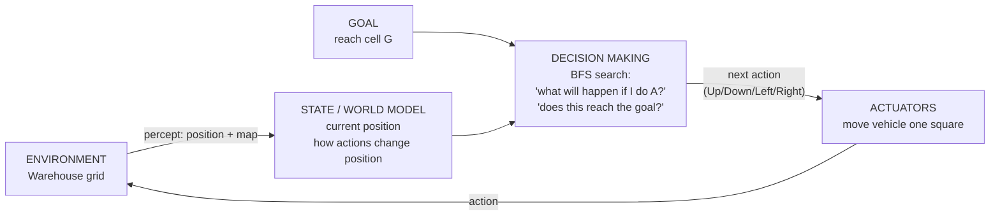

# AI Lab – Goal-Based Warehouse Navigation Agent

Laboratory exercise: constructing a goal-based agent with the help of a Large Language Model.

## Files

| File | Purpose |
|------|---------|
| `warehouse_agent.py` | The goal-based agent (BFS path planner) |
| `test_agent.py` | Tests: valid path, shortest length, no-path case |
| `README.md` | Design, prompt log and answers to the lab questions |

## How to run

```bash
python warehouse_agent.py   # solves the warehouse map
python test_agent.py        # runs the tests
```

Requires Python 3.x only (standard library; no extra packages).

## Output

```
#####################
#S***.#************G#
#.##****##########..#
#....##.............#
#.######.###.#.###..#
#........#..........#
#####################
```

Shortest path: **20 moves**
`Right ×3, Down, Right ×3, Up, Right ×12`

---

## Task 1 – Understanding the Problem

1. **Environment:** A 7 × 21 grid warehouse. Cells are free (`.`) or obstacles (`#`). It is static (nothing moves), fully observable (the whole map is known), deterministic (a move always succeeds if the target cell is free), discrete, and single-agent.
2. **Goal:** Reach cell `G` (row 1, col 19) from `S` (row 1, col 1) without entering an obstacle.
3. **Actions:** Up, Down, Left, Right – each moves one grid square.
4. **Information to maintain:** The current position (state), the goal position, the map/transition model (which moves are legal), and the explored set/frontier plus parent links used during search to build the plan.
5. **Why goal-based, not simple reflex:** A reflex agent maps the current percept directly to an action (condition–action rules) and has no notion of a target. Here, a locally "good" move can lead into a dead end (e.g. the pocket at the bottom-left). The agent must consider the *future consequences* of actions – searching ahead for a sequence that satisfies an explicit goal test – so it is goal-based.

### Think About It – warehouse twice as large
BFS would still be *correct*, but not scalable: it stores every explored cell and its time and memory grow with the number of cells (roughly O(b^d); on a grid O(rows × cols)). Doubling each dimension gives ~4× the cells. Difficulties: memory use, slower search, many equal-cost paths, and in a real warehouse – moving obstacles/other vehicles, partial observability, different move costs (turns, speed), and the need to re-plan. Better choices: **A\*** with a Manhattan-distance heuristic (explores far fewer nodes and is still optimal), hierarchical planning, or D\* Lite for dynamic environments.

---

## Task 2 – Agent Design

| Component | In this problem |
|-----------|-----------------|
| Environment | 7×21 warehouse grid with shelving obstacles |
| Current state | Vehicle position `(row, col)` |
| Goal | Position of `G` – `goal_test(state)` |
| Actions | Up, Down, Left, Right |
| Decision-making component | BFS planner that searches ahead and returns an action sequence |

### Block diagram



ASCII version:

```
            +---------------------------+
 percepts   |   STATE / WORLD MODEL     |
ENVIRONMENT |  position, map, effect of |
 ---------> |  each action              |
   ^        +-------------+-------------+
   |                      |
   |        +-------------v-------------+      +--------+
   |        |  DECISION MAKING (BFS)    |<-----+  GOAL  |
   |        |  "which action sequence   |      | reach G|
   |        |   reaches the goal?"      |      +--------+
   |        +-------------+-------------+
   |                      | action
   |        +-------------v-------------+
   +--------+  ACTUATORS (move 1 cell)  |
            +---------------------------+
```

---

## Task 3 – Prompt Engineering

### Prompt used

> Write a well-documented Python program implementing a goal-based agent for the warehouse navigation problem shown below. The program should: represent the warehouse as a two-dimensional grid; determine a collision-free path from S to G; avoid all obstacles; print either the path found or a suitable message if no path exists; explain the search algorithm that has been chosen and why it is appropriate.
>
> ```
> #####################
> #S....#............G#
> #.##....##########..#
> #....##.............#
> #.######.###.#.###..#
> #........#..........#
> #####################
> ```

### Answers

1. **Did the LLM generate a working program on the first attempt?**
   Yes – the program ran without errors and returned a valid 20-move path. *(If your own LLM run failed, replace this with what went wrong and how you fixed it.)*
2. **If not, how can the prompt be improved?**
   State the movement rules (4-directional, no diagonals), the data representation (list of strings → grid), the required output (path as coordinates and drawn on the map), edge cases (no path, start = goal) and ask for tests. Pasting the error message back into the LLM is the fastest way to fix runtime bugs.
3. **Which search algorithm?** Breadth-First Search (BFS).
4. **Why was it selected?** All moves cost the same (1), so BFS is **complete** and **optimal** (shortest path in number of moves). The map is small, so its memory cost is acceptable; it is simple to implement and explain; and it uses an explored set to avoid loops. For larger maps, A\* would be preferable.

### Iterative improvement (suggested follow-up prompts)
- "Add an explored set so cells are not revisited."
- "Draw the path on the map using `*`."
- "Add unit tests including a map with no path."

## Critical Evaluation of LLM-Assisted Development

**Strengths:** fast boilerplate, readable documentation, quickly explains algorithm choice, easy to iterate.
**Limitations:** may produce plausible but wrong code, may pick an algorithm without weighing alternatives, may miss edge cases unless asked, and the programmer must still test and understand the output – which is why `test_agent.py` is included.

Lab 1: goal-based warehouse navigation agent (BFS).
